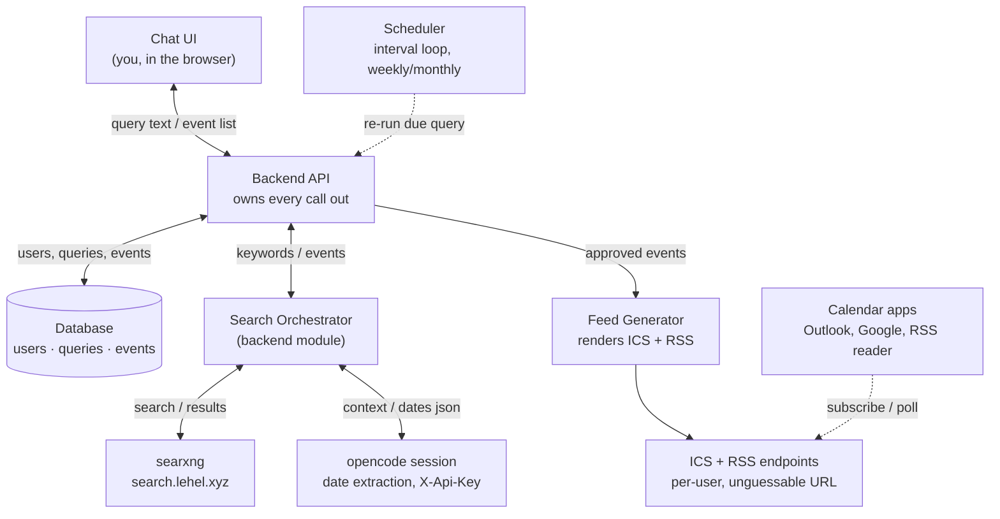
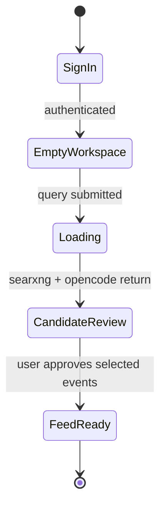

# dontforget — High-Level Design

> Status: architecture approved 2026-08-08. First-time user journey approved
> 2026-08-09 (see §7); spec details still open (see §8).
> Written during design collaboration in the `servyy-container` infra repo,
> where `searxng` and `opencode` — the two backend dependencies — already run.

## Problem

Some events recur every year but never on the same date — Oktoberfest, the
Auer Dult in Munich (three times a year), a touring artist's next concert
near a given city. It's easy to search for one of these once and then forget
to check back next year.

`dontforget` keeps the query alive: it searches on a schedule, asks
`opencode` to read the results and pull out real dates, and publishes
whatever the user approves as a calendar feed they subscribe to once.

## 1. Decided so far

- Multi-user from day one (real login, per-user data isolation)
- TypeScript / Node, full-stack
- New repo (this one) for application code; deployment automation lives in
  the `servyy-container` infra repo, modeled on the `ls_app` role used for
  leaguesphere
- Test on `servyy-test.lxd` before `lehel.xyz`; production deploy requires
  explicit approval (infra repo policy)
- Approved queries auto-add new dates found on scheduled re-runs — no
  re-approval needed once a query is trusted

## 2. How a request moves through the system



Solid arrows are synchronous calls in the request path; dashed arrows are the
two things that happen without the user in the loop — the scheduler waking a
query back up, and a calendar app pulling the feed on its own timer. The
Backend API is the only component that talks to more than one other
component, which is what lets searxng or opencode be swapped later without
touching the chat UI or the feed format.

## 3. Components

| Component | Responsibility | Notes |
|---|---|---|
| Chat UI | Free-text query input, review/approve screen for candidate events, feed subscription links, login. | Node/TS frontend. "Chat" is one input box plus a results list, not a general conversation UI. |
| Backend API | Auth, query CRUD, orchestrates search + extraction, writes approved events, serves feeds. | The only component with credentials for searxng, opencode, and the database. |
| Search Orchestrator | Turns a query into searxng calls, then hands results to opencode as context, returns structured events. | A module inside the backend, not a separate service — drawn apart because it's the part most likely to be swapped or extended. |
| searxng | Web search. Already deployed at `search.lehel.xyz`. | Existing infra service, no changes needed. |
| opencode session | Reads search results, extracts event dates as structured JSON. Nothing else. | Called through the `X-Api-Key` ForwardAuth gate — session-scoped, no filesystem/shell access. |
| Database | Users, saved queries (with recurrence interval), events (candidate → approved), feed tokens. | Postgres, matching the rest of the infra's service conventions. |
| Scheduler | Wakes each saved query on its own interval, re-runs the search orchestrator. | A daily interval-triggered job inside the backend container — no separate service needed at this scale. |
| Feed Generator | Renders each user's approved events as ICS and RSS. | Feed URLs carry an unguessable per-user token — no login prompt from calendar clients. |

## 4. The open fork: who does the searching

A recent change to the infra repo deliberately *stopped short* of wiring
searxng into opencode's own agent config, leaving it out as a separate
follow-up. This design had to pick a side of that fork, because it's the one
decision that changes what opencode is allowed to do.

### Option B — Backend drives the search (chosen)

The Search Orchestrator calls searxng directly over HTTP, then opens an
opencode session and pastes the results in as context: *"here are 8 search
results about 'Auer Dult Munich', extract every date mentioned."* opencode
only ever reasons over text it's handed — it never issues its own searches.

- opencode's role stays exactly what the ForwardAuth work scoped it to: a
  narrow, session-only extraction call.
- Search logic (query building, pagination, re-ranking) lives in our own
  code — easy to test, easy to swap providers later.
- One extra HTTP client to write; no changes to opencode's shared agent
  config, which another automated client also depends on.

### Option A — opencode searches itself (not chosen)

Wire searxng in as a tool in opencode's agent config. The backend opens one
session with the raw user query and lets opencode decide what to search, run
follow-up searches, and read pages itself.

- Better for hard cases — a multi-step agent can notice "Auer Dult happens
  3× a year" and search for each occasion separately.
- Reopens the exact scope decision the ForwardAuth work deferred; needs its
  own review of what a search-capable opencode can reach.
- Couples this service to opencode's shared config — a change here can
  affect the other client using opencode today.

**Decision:** start with Option B. It's the smaller, already-scoped surface,
keeps the search logic testable without mocking an LLM, and doesn't touch
shared opencode config that another client relies on. If extraction quality
turns out to need multi-step search reasoning, that's a scoped follow-up —
same shape as the deferred decision already on record, not a reason to block
this design.

## 5. Query & event lifecycle

A query is a standing instruction ("remind me of Auer Dult dates"); an event
is one concrete date it finds.

```
query saved → search + extract → candidate events → user approves → in feed
```

On the query's next scheduled run, new or changed dates skip the approval
step and go straight into the feed — an already-approved query is trusted
going forward. Calendar apps that already subscribed just pick up the
update on their normal refresh.

## 6. Deployment

Follows the same shape as `leaguesphere`: application code lives in this
repository; the `servyy-container` infra repo only holds the Ansible role
that deploys it.

- New Ansible role in `servyy-container`, modeled on `ls_app`
- `servyy-test.lxd` first, `lehel.xyz` only after explicit approval
- Traefik routing + calendar feed URLs following the infra repo's existing
  service conventions

## 7. User journey — first-time happy path

Scope: a first-time user's single pass through the core loop, sign-in to
subscribed feed. Return-visit flows (dashboard of saved queries, re-run
notifications) are deliberately out of scope here — a separate pass once
this shape is validated.

Chosen layout: a single continuous "workspace" page, not a step wizard. The
query input never navigates away; a results card below it morphs through
loading → review → feed-ready. This follows directly from the Chat UI
framing already decided in §3 — "one input box plus a results list, not a
general conversation UI." It also leaves room to extend to return visits
later without a structural rewrite: additional saved queries would just be
more cards stacked below the input, not a different page.



### States

| # | State | What the user sees | What's happening |
|---|---|---|---|
| 1 | Sign in | Minimal magic-link screen: email in, link out. No password field, no marketing page. | Auth only. Backend emails a single-use sign-in link; clicking it authenticates and lands on state 2. |
| 2 | Empty workspace | One centered input box, placeholder text (e.g. "What do you want to track?"). No saved-queries list — first-time user has none yet. | — |
| 3 | Submitted / loading | Query becomes a small "chip" pinned above the input; a card below shows a loading state. | Synchronous call: Search Orchestrator hits searxng, then opencode extracts dates from the results (§2, §4 Option B). Expected to resolve in single-digit seconds — not treated as a background job. |
| 4 | Candidate review | Loading card morphs into a list: one row per candidate event (date, short label from the source, source link), each with a pre-checked checkbox. One "Approve selected" action. | Candidate events exist in the DB as `candidate`, one row per date (§5, §3 Database). Per-event granularity lets the user drop a stale/wrong date (e.g. a duplicate Auer Dult date) without rejecting the whole batch. |
| 5 | Feed ready | Card morphs again: approved dates listed read-only, plus two subscribe URLs (ICS and RSS) with copy buttons, and a note that future scheduled runs auto-add new dates with no extra approval. | Approving flips selected events to `approved` (§5) and mints/reuses the user's feed token (§3 Feed Generator). Both ICS and RSS ship in v1 — see decisions below. |

### Decisions made in this pass

- **Feed formats in v1: both ICS and RSS**, not ICS-first. Removes the
  "RSS in v1?" item that was open below — the Feed Generator was already
  scoped to render both, so there's no reduced-scope version to build
  first.
- **First run is synchronous**, not queued. The user watches the loading
  state resolve inline rather than leaving and coming back or waiting on a
  notification. This applies only to the *first* run triggered from the
  workspace; scheduled re-runs (§1, §5) remain background jobs — they have
  no live page to render into.
- **Approval is per-event**, not per-batch. Matches the
  `candidate → approved` model already in §5's data lifecycle — that model
  only makes sense if individual events can be approved independently.
- **Auth is magic link**, not email/password or OAuth. No password to
  store, reset, or breach; one email field is also the smallest possible
  state-1 screen. Trades off a dependency on transactional email
  deliverability, and sign-in requires checking the inbox rather than
  typing a remembered password — acceptable for a low-frequency,
  notification-adjacent tool like this one.

### Explicitly out of scope for this pass

- Return-visit experience: dashboard of saved queries, how the user learns
  a scheduled re-run found something new.
- Empty/error states: zero search results, opencode extraction failure,
  network timeout.

## 8. Still open

Not blocking the high-level architecture or the first-time happy path, but
need answers before the detailed implementation spec:

- Magic-link delivery: which transactional email provider, link expiry
  window
- Empty/error states for the workspace (zero results, extraction failure,
  timeout)
- Rate limits / cost guardrails on opencode + searxng calls per query
- Return-visit experience (dashboard of saved queries) — deliberately
  deferred, not yet designed
