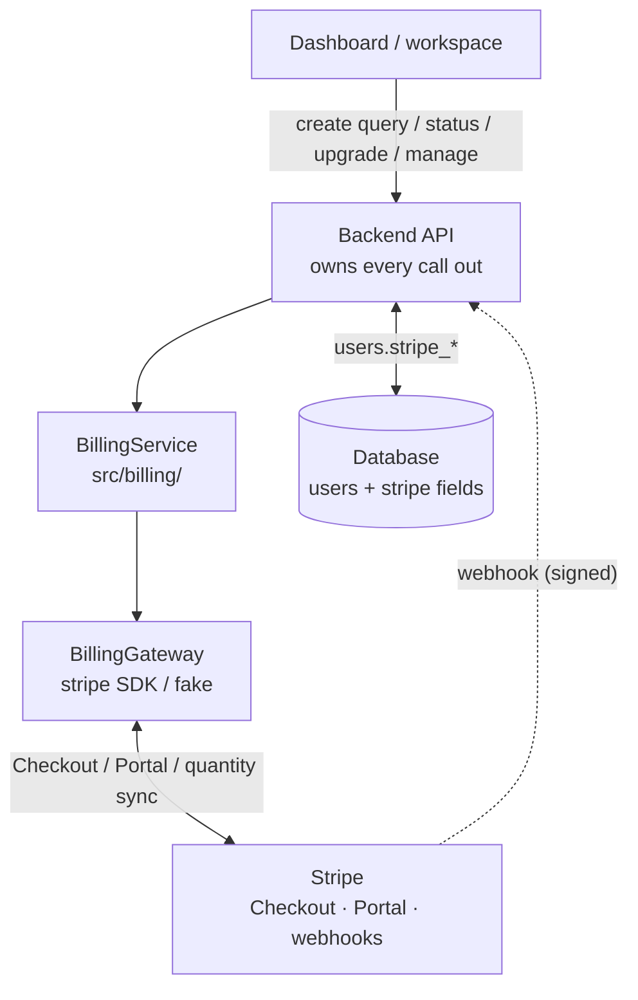

# Stripe Billing — High-Level Design (spec)

> Status: approved for implementation 2026-08-18 (internal memo "Stripe
> integration — pick a path", 2026-08-11). Pricing is locked; this spec fixes
> the build surface. The implementation plan lives at
> `docs/superpowers/plans/2026-08-18-stripe-billing.md`.

## Problem

dontforget tracks things that recur on unpredictable dates. Charging for it
requires billing infrastructure with the same posture as the rest of the
system: the backend is the only credentialed hub, and no card data ever
touches our servers.

## Decided pricing

- **1 free query per account** — no card required.
- **€0.50 per query after that**, billed on however many queries are active
  (e.g. 5 active queries = 1 free + 4 paid = €2/mo).
- **Monthly cadence** (decided 2026-08-18; annual is a config swap later).
- Implemented as one Stripe **graduated-tiered monthly Price**: tier 1 =
  first unit free, tier 2 = every further unit at €0.50. The subscription's
  **quantity equals the account's active query count** — Stripe computes the
  bill, dontforget only keeps quantity in sync.

## Architecture

- Checkout and the Customer Portal run on Stripe's domains — the backend
  only ever stores and forwards Stripe object ids (`cus_…`, `sub_…`).
- The webhook is signature-verified and dedupes by event id (Stripe retries).

## Data model

Users gain three optional fields (Mongo is schemaless; service code writes
them at use time):

- `stripe_customer_id` — unique, sparse index (webhook lookups)
- `stripe_subscription_id`
- `stripe_subscription_status` — `'active'` is the only "subscribed" value

Plus a `stripe_events` collection keyed by event id for webhook idempotency.

## API surface

| Endpoint | Auth | Purpose |
|---|---|---|
| `POST /api/billing/checkout` | session | Starts the graduated-price subscription at `max(1, active queries)`; 303 → Stripe Checkout |
| `GET /api/billing/portal` | session | 303 → Stripe Customer Portal (self-serve cancel/upgrade) |
| `GET /api/billing/status` | session | `{ freeLimit, activeQueryCount, pricePerExtraQuery, subscribed, subscriptionStatus, checkoutUrl, portalUrl }` |
| `POST /api/billing/webhook` | signature | `checkout.session.completed` · `customer.subscription.updated` · `customer.subscription.deleted` |

## Enforcement

- **Hard free-tier gate:** `POST /api/queries` returns `402` with a checkout
  URL when the user has no active subscription and already holds ≥1 query —
  checked **before** the search runs so searxng/opencode is never burned on a
  query that cannot be created.
- **Quantity sync:** every query create/delete calls
  `subscriptionItems.update(quantity = max(1, activeCount))` when a
  subscription exists. The clamp keeps live-mode Stripe happy (qty 0 is
  test-mode-only); unit #1 is free under the tier anyway.

## Config (env, never committed)

- `STRIPE_SECRET_KEY` — absent ⇒ billing routes return `503` (null gateway)
- `STRIPE_PRICE_ID` — the graduated tiered monthly price
- `STRIPE_WEBHOOK_SECRET` — absent ⇒ webhook returns `503`

## Out of scope for v1

- **Scheduler enforcement:** a lapsed subscription stops *new* queries but
  does not pause re-runs of existing ones. Decision deferred.
- **Annual billing:** one-line config swap (`STRIPE_PRICE_ID`), not built.
- **Tax/VAT:** handled in the Stripe dashboard.
- **Cost re-measure:** opencode's free-model access is a borrowed assumption
  (memo §04); re-measure when it looks shaky — the €0.50 rate is the knob.