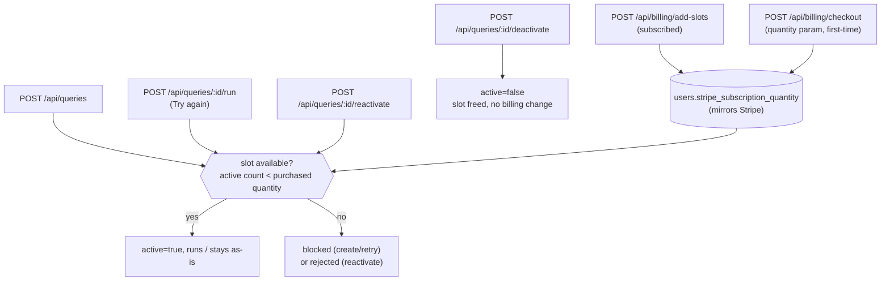

# Query Credits & Pause/Resume — High-Level Design (spec)

> Status: approved for implementation 2026-08-20. Builds directly on the
> Stripe billing plumbing from `docs/superpowers/specs/2026-08-18-billing-design.md`
> (PR #111, not yet merged) — this branch (`feat/query-credits`) is based on
> that branch's tip, including a POST-vs-GET checkout fix found while
> smoke-testing #111 on servyy-test.

## Problem

Live-testing PR #111 on servyy-test surfaced a product gap, not a bug: the
free-tier gate blocks *creating* a 2nd query outright. But searxng search is
cheap; only the opencode extraction step actually costs money. Blocking
creation wastes the free search, gives no way to prepay for future capacity,
and gives up a query's saved configuration/history the moment you want to
free up room for something else — the only lever today is `DELETE`.

## Decided model

- **Searching stays free; only the agent (opencode extraction) is gated.**
  A query can always be created and saved. If a paid "slot" is available it
  runs immediately, exactly as today. If not, it's saved in a new `blocked`
  state and simply never gets its `runQuery` call until a slot frees up.
- **A "slot" = one active (non-deactivated) query.** This is the existing
  active-query-count concept, just renamed and no longer counting deleted
  *or deactivated* queries.
- **Quota is bought in advance, via the existing subscription — not a new
  prepaid-credits system.** "Buying credits" means raising the Stripe
  subscription's `quantity` ahead of how many queries you're actually
  running. The graduated Price (tier 1 free, tier 2 €0.50/unit) is unchanged
  and still does the free-first-unit math regardless of how many units you
  buy at once.
- **Deactivating a query frees its slot without changing what you pay.**
  You keep paying for the same quantity; deactivating just means one fewer
  query is occupying it, freeing that occupancy for another query. Its
  events disappear from the calendar/RSS feed while deactivated.
- **Reactivating never triggers an agent run by itself** — it's purely the
  `active` flag flipping back on, gated by slot availability. Whatever the
  query's `status` already implies resumes as-is: a `ready` query's events
  reappear in the feed; a `failed` query becomes visible again with its
  existing "Try again" action available. Only `blocked` queries (which
  never occupied a slot to begin with) go through retry, not reactivate —
  retry is the one path that can trigger a real, costed agent run.
- **Unblocking/reactivating is manual, not automatic.** Freeing or buying a
  slot does not auto-resume anything. The user retries a blocked query (the
  existing "Try again" action) or explicitly reactivates a paused one.
- **`runQuery` (search + extraction) stays one bundled call.** A blocked
  query hasn't searched yet either — splitting the free search from the
  paid extraction into two persisted phases is a bigger architecture change
  than this feature needs.
- **Delete still auto-shrinks the subscription quantity**, unchanged from
  today — it's the one action final enough that it should stop billing for
  a slot nobody can reuse. Deactivate never touches billing.
- **Downgrading quantity on purpose stays a manual Stripe Billing Portal
  action** — out of scope here.

## Architecture

## Data model

`queries` gains one field:

- `active: boolean` (default `true`) — controls slot occupancy, feed
  inclusion, and scheduler eligibility. Independent of `status`.

`QueryStatus` gains one value: `'blocked'` — created, but no slot was free,
so `runQuery` has never fired for this query.

`users` gains one field:

- `stripe_subscription_quantity: number` — local mirror of the Stripe
  subscription's quantity (purchased slots), updated by the webhook handler
  (same pattern as `stripe_subscription_status`) and by `add-slots`/checkout
  completion. Absent for never-subscribed users, who implicitly have 1
  purchased slot (`FREE_QUERY_LIMIT`), same as today.

No new collections.

## API surface (new/changed)

| Route | Change |
|---|---|
| `POST /api/queries` | No more `402` here. Always creates the row. Slot available → `active:true, status:'running'`, runs as today. Not available → `active:false, status:'blocked'`. |
| `POST /api/queries/:id/run` | Gains the slot check for `blocked` queries (existing "Try again" button). Still-blocked → `409` with a reason. |
| `POST /api/queries/:id/deactivate` | New. Only valid when `active:true` and `status !== 'running'` (can't pause mid-flight — matches the existing "already running" rejection on `/run`). Sets `active:false`. Never touches billing. `status` untouched. |
| `POST /api/queries/:id/reactivate` | New. Only valid when `active:false` and `status !== 'blocked'` (a blocked query never held a slot, so it retries instead — see `/run` above). Slot available → `active:true`, done. Not available → `409`, same reason as retry. |
| `POST /api/billing/add-slots` | New. Body `{ count }`. Only for already-subscribed users: `updateSubscriptionQuantity(current + count)`, mirrors new total to `users.stripe_subscription_quantity`. |
| `POST /api/billing/checkout` | Gains a `quantity` param (default 1) instead of deriving quantity from active-query-count — lets a first-time subscriber prepay for more than one slot. |
| `GET /api/billing/status` | `BillingStatus` gains `purchasedSlots` / drops the now-inaccurate `activeQueryCount`-as-a-limit framing in favor of "used of purchased". |
| `DELETE /api/queries/:id` | Unchanged: deletes row + events, syncs quantity down. |

## Feed & scheduler

- `src/feed/routes.ts` — the query lookup that assembles feed events adds
  `active: true` to its filter. This is the entire fix for events
  disappearing from ICS/RSS on deactivate; the route already re-derives
  events from `queries` on every request, nothing to invalidate/cache.
- `src/scheduler/dueQueries.ts` — `findDueQueries` adds `active: true` to
  its filter, so deactivated and blocked queries are never picked up for
  recurring re-runs.

## Frontend

- New `blocked` card state (styled like `failed`): "Needs credits to
  search," with **Try again** (re-checks the gate) and **Buy credits**
  (routes into checkout/add-slots) actions.
- `ready`/`failed` query cards gain a **Pause**/**Resume** toggle
  (deactivate/reactivate) — hidden while `running` and on `blocked` cards,
  matching the API's own restrictions. Paused queries stay in the same
  list, visually muted, event counts still shown.
- Billing row changes from "N free queries remaining" to "used of
  purchased" (e.g. "2 of 3 credits used"), plus a stepper/input to buy more
  — wired to `add-slots` for subscribers, to checkout-with-quantity for
  first-timers.

## Error handling

- **Atomic slot claim.** Two blocked/paused queries retried at once must
  not both claim the same last free slot — the claim (flipping `active` to
  `true`) and the availability check must happen as a single atomic
  conditional write (e.g. `findOneAndUpdate` re-verifying the count in the
  same operation), not check-then-write.
- `409` responses from retry/reactivate carry a reason the frontend can
  show verbatim ("no free credits — buy more or pause another query").

## Out of scope

- Prepaid one-time credit packs (rejected during design — keeping the
  existing recurring subscription was the explicit choice).
- Auto-resuming blocked/paused queries when a slot frees (rejected —
  manual retry/reactivate was the explicit choice).
- Splitting `runQuery` into a persisted search phase + deferred extraction
  phase (rejected — bundled call stays bundled).
- Voluntary downgrade of purchased quantity (stays a Stripe Billing Portal
  action).
